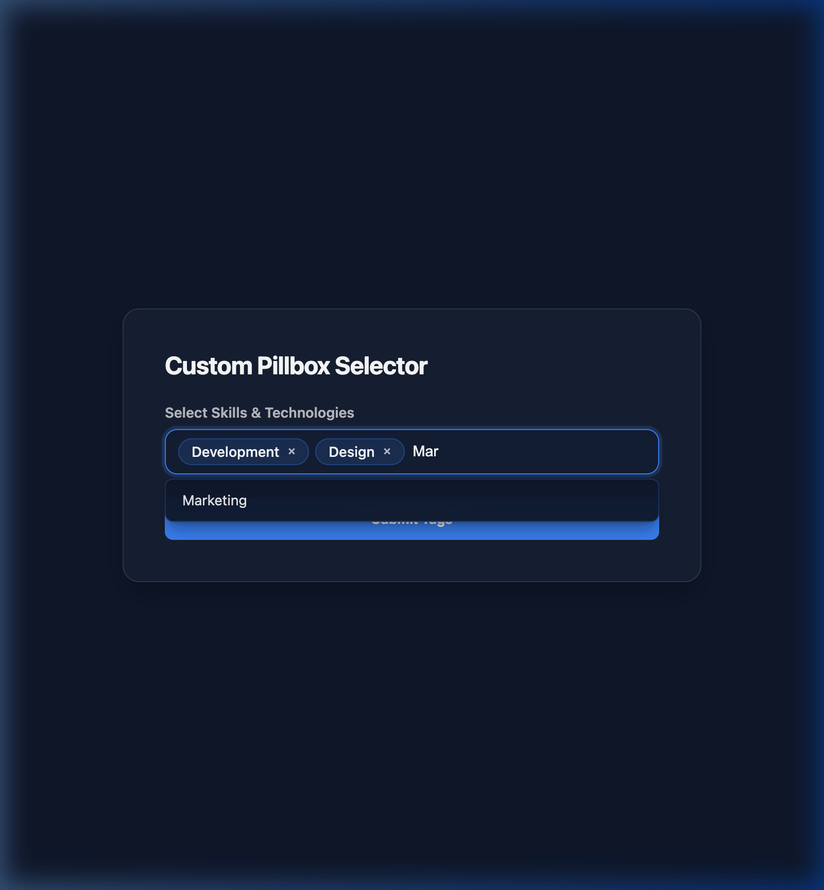

# Custom Pillbox Input Module

An interactive tag/chip selector component designed for front-end website forms. It allows users to type custom tags (with Enter/Comma creation) or pick from auto-suggested options, rendering selections as interactive removable pills.

---

## Features

- **Semantic Multiple-Select Backend**: Renders an underlying `<select multiple>` element. Forms automatically serialize and parse this field as separate values (`tags=tag1&tags=tag2`) rather than a single comma-separated string.
- **Active Change Event Dispatches**: Fires standard DOM `change` events on selection updates, making it compatible with HubSpot forms libraries or third-party reactive framework scripts.
- **Auto-Suggestions & Fallback**: Displays a dropdown that filters available auto-suggest options based on what the user types. If no options match, it displays a localized "No suggestions found" list item.
- **Limit Detection & Lock**: Automatically disables the input box and changes the placeholder to a localized limit message when the maximum pill count is reached.
- **Keyboard Navigation**: Fully accessible arrow-key selections and Escape closing triggers.
- **Visual Validation**: Shakes the boundary container to indicate errors when duplicate tags are entered.
- **Dynamic Tag Coloring**: Hashes the tag's string values so that each unique tag receives a stable, consistent color from either the default palette or the editor's custom colors list.
- **WCAG AAA Compliance Contrast**: Automatically traverses the DOM to find the computed background color, performs alpha blending with the translucent pill color (`alpha = 0.15`), calculates the relative luminance of the blended background, and dynamically sets the text/close button color to either `#ffffff` or `#0f172a` to guarantee a minimum contrast ratio of at least $7\text{:}1$.
- **Native OS Scheme Support**: Syncs with `prefers-color-scheme` media queries to assume a dark fallback background if the browser has default dark mode activated and no explicit page background is declared.

---

## Editor Settings (Fields)

### Content Tab

1. **Input Placeholder** (`placeholder_text`): Placeholder label in the empty input field.
2. **Maximum Tags Allowed** (`max_pills`): Maximum number of tags a visitor can add.
3. **Limit Reached Alert Text** (`limit_reached_text`): Localizable text shown in the input box once the tag threshold is reached (default: "Limit reached").
4. **Remove Tag Accessibility Label** (`remove_button_label`): Aria screen reader translation for close buttons (default: "Remove").
5. **No Suggestions Match Text** (`no_matches_text`): Dropdown fallback text when no options match the query (default: "No suggestions found").
6. **Predefined Auto-Suggest Options** (`predefined_suggestions`): Repeater text list of autocomplete entries.
7. **Custom Tag Colors** (`custom_colors`): Optional repeated color pickers. If provided, pills will cycle through this custom palette instead of the defaults.
8. **Form Field Name** (`field_name`): Custom name attribute parameter to prevent selector collision across multiple module instances (default: "custom_pillbox_tags").

### Style Tab

1. **Background Mode** (`bg_style`): Select between Solid Color or Glassmorphic Frost.
2. **Primary Accent Color** (`primary_color`): Accents active pill backgrounds and dropdown focus outlines (inherits from `theme.primary_color`).
3. **Text Color** (`text_color`): Accents tags font color (inherits from `theme.secondary_color`).

---

## Technical Integration

To embed this inside standard HTML forms:

1. Place the module inside a `<form>` block.
2. When forms submit, the value is captured via the `<select name="custom_pillbox_tags" multiple>` element.
3. On the backend, process `custom_pillbox_tags` as an array of values.
