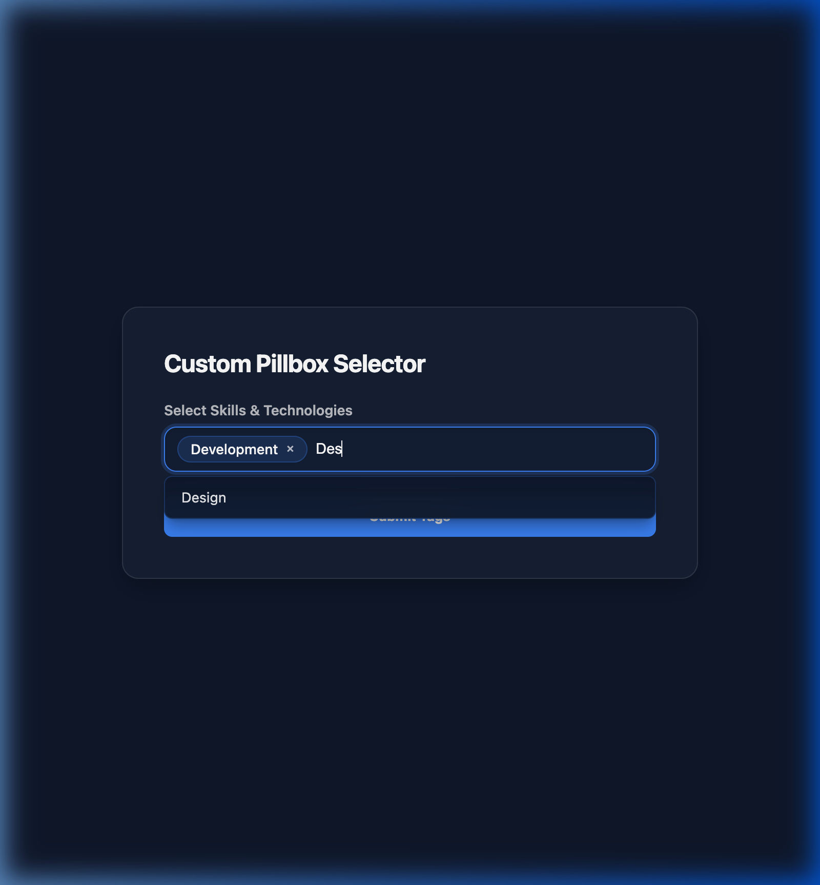

# Custom Pillbox Input Module

An interactive tag/chip selector component designed for front-end website forms. It allows users to type custom tags (with Enter/Comma creation) or pick from auto-suggested options, rendering selections as interactive removable pills.

---

## Features

- **Semantic Multiple-Select Backend**: Renders an underlying `<select multiple>` element. Forms automatically serialize and parse this field as separate values (`tags=tag1&tags=tag2`) rather than a single comma-separated string.
- **Active Change Event Dispatches**: Fires standard DOM `change` events on selection updates, making it compatible with HubSpot forms libraries or third-party reactive framework scripts.
- **Auto-Suggestions**: Displays a dropdown that filters available auto-suggest options based on what the user types.
- **Keyboard Navigation**: Fully accessible arrow-key selections and Escape closing triggers.
- **Visual Validation**: Shakes the boundary container to indicate errors when duplicate tags are entered or when the maximum allowed count is exceeded.

---

## Editor Settings (Fields)

### Content Tab

1. **Input Placeholder** (`placeholder_text`): Placeholder label in the empty input field.
2. **Maximum Tags Allowed** (`max_pills`): Maximum number of tags a visitor can add.
3. **Predefined Auto-Suggest Options** (`predefined_suggestions`): Repeater text list of autocomplete entries.

### Style Tab

1. **Background Mode** (`bg_style`): Select between Solid Color or Glassmorphic Frost.
2. **Primary Accent Color** (`primary_color`): Accents active pill backgrounds and dropdown focus outlines (inherits from `theme.primary_color`).
3. **Text Color** (`text_color`): Accents tags font color (inherits from `theme.secondary_color`).

---

## Technical Integration

To embed this inside standard HTML forms:

1. Place the module inside a `<form>` block.
2. When forms submit, the value is captured via the `<select name="custom_pillbox_tags" multiple>` element.
3. On the backend, process `custom_pillbox_tags` as an array of values.
